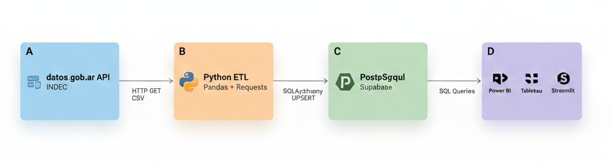

# 📊 IPC Argentina - Automated Data Pipeline

> **End-to-end ETL pipeline for Argentine inflation analysis with a dimensional model in PostgreSQL**

This project extracts Consumer Price Index (CPI) data from Argentina's public API (datos.gob.ar), transforms it into a Star Schema model, and loads it into PostgreSQL with automated monthly incremental updates.

## 🎯 Objective

Centralize Argentina's historical inflation data into a relational database optimized for multidimensional analysis, enabling calculation of key metrics (MoM, YoY, category incidence) and generating economic insights by region and category.

---

## 🏗️ System Architecture



**Data flow:**
1. **Extract:** Automated download from public API (3 CSV endpoints)
2. **Transform:** Wide→Long normalization + metadata parsing
3. **Load:** Star Schema with incremental updates via UPSERT
4. **Visualize:** Dashboards connected via SQL queries

---

## ⚙️ ETL Pipeline Highlights

### **Extract**
- Consumption of public REST API (datos.gob.ar) with error handling and timeouts
- Data structure validation before processing
- Automatic detection of newly available periods

### **Transform**
- **Unpivot:** Wide to Long format conversion using `pandas.melt()`
- **Parsing:** Metadata extraction (region, category) from column names
- **Cleaning:** Null removal, date normalization, type validation

### **Load**
- **Incremental logic:** `ON CONFLICT ... DO UPDATE` to prevent duplicates
- **Dimensional model:** Star Schema with optimized fact/dimension tables
- **Indexes:** Temporal query optimization (`idx_fact_fecha`, `idx_fact_region`)

### **Orchestration**
- Scheduled scripts (Cron / GitHub Actions) for automatic monthly execution
- Detailed logs with insert/update metrics
- Handles INDEC retroactive revisions (downloads last 2 months)

---

## 📐 Data Model - Star Schema

```sql
-- Dimension Tables
CREATE TABLE dim_region (
    region_id   SERIAL PRIMARY KEY,
    region_name VARCHAR(50) UNIQUE
);

CREATE TABLE dim_category (
    category_id   SERIAL PRIMARY KEY,
    category_name VARCHAR(100) UNIQUE,
    classification VARCHAR(50)
);

-- Fact Table
CREATE TABLE fact_inflation (
    date        DATE,
    region_id   INT REFERENCES dim_region(region_id),
    category_id INT REFERENCES dim_category(category_id),
    index_value DECIMAL(18, 4),
    PRIMARY KEY (date, region_id, category_id)
);

-- Indexes
CREATE INDEX idx_fact_date     ON fact_inflation(date);
CREATE INDEX idx_fact_region   ON fact_inflation(region_id);
CREATE INDEX idx_fact_category ON fact_inflation(category_id);
```

**Granularity:** Monthly | **Period:** Dec 2023 → Present | **Records:** ~30,000+

---

## 📊 SQL Queries - Window Functions

### **Month over Month Variation (MoM)**

```sql
WITH monthly_inflation AS (
    SELECT
        f.date,
        f.index_value,
        LAG(f.index_value) OVER (ORDER BY f.date) AS prev_month_value
    FROM fact_inflation f
    JOIN dim_region   r ON f.region_id   = r.region_id
    JOIN dim_category c ON f.category_id = c.category_id
    WHERE r.region_name    = 'Nacional'
      AND c.category_name  = 'Nivel General'
      AND c.classification = 'Total'
)
SELECT
    date,
    index_value AS current_index,
    ROUND(((index_value / prev_month_value - 1) * 100), 2) AS mom_variation_pct
FROM monthly_inflation
WHERE prev_month_value IS NOT NULL
ORDER BY date DESC
LIMIT 12;
```

### **Year over Year Variation (YoY)**

```sql
WITH yearly_inflation AS (
    SELECT
        f.date,
        f.index_value,
        LAG(f.index_value, 12) OVER (ORDER BY f.date) AS prev_year_value
    FROM fact_inflation f
    JOIN dim_region   r ON f.region_id   = r.region_id
    JOIN dim_category c ON f.category_id = c.category_id
    WHERE r.region_name   = 'Nacional'
      AND c.category_name = 'Nivel General'
)
SELECT
    date,
    index_value,
    ROUND(((index_value / prev_year_value - 1) * 100), 2) AS yoy_variation_pct
FROM yearly_inflation
WHERE prev_year_value IS NOT NULL
ORDER BY date DESC
LIMIT 12;
```

---

## 📊 Business Intelligence & Analytics

The Star Schema model is ready to connect with any BI visualization tool.

### **Available KPIs**

- **MoM (Month over Month):** Last month's inflation rate
- **YoY (Year over Year):** Year-on-year comparison
- **Cumulative Inflation:** From the start of the year or any specific period
- **Category Incidence:** Which categories explain the most of total inflation
- **Core vs Non-Core Analysis:** Core, Regulated, and Seasonal components
- **Regional Disparity:** Comparison across GBA, Pampeana, NOA, NEA, Cuyo, Patagonia

### **Visualization Tools**

| Tool | Connection | Use Cases |
|------|------------|-----------|
| **Power BI** | PostgreSQL Connector | Executive dashboards, automated reports |
| **Tableau** | Native PostgreSQL | Ad-hoc analysis, visual storytelling |
| **Streamlit** | SQLAlchemy | Interactive web applications |
| **Python (Pandas)** | psycopg2 / SQLAlchemy | Exploratory analysis, notebooks |

---

## 🚀 Installation & Setup

```bash
# 1. Clone the repository
git clone https://github.com/your-username/ipc-argentina-pipeline.git
cd ipc-argentina-pipeline

# 2. Create virtual environment and install dependencies
python -m venv venv
source venv/bin/activate   # Windows: venv\Scripts\activate
pip install -r requirements.txt

# 3. Set up credentials (create .env file)
cp .env.example .env
# Edit .env with your Supabase credentials

# 4. Initial load
python ipc_scraper.py       # Download data
python db_setup_secure.py   # Create structure and load

# 5. Monthly update (automate with cron/GitHub Actions)
python update_monthly.py
```

---

## 🛠️ Tech Stack

| Component | Technology |
|-----------|------------|
| **Language** | Python 3.10+ |
| **ETL** | Pandas, Requests |
| **Database** | PostgreSQL (Supabase) |
| **ORM** | SQLAlchemy |
| **Orchestration** | GitHub Actions / Cron |
| **BI Tools** | Power BI, Tableau, Streamlit |

---

## 📚 References

- [INDEC - CPI Methodology](https://www.indec.gob.ar/indec/web/Nivel4-Tema-3-5-31)
- [datos.gob.ar - CPI Dataset](https://datos.gob.ar/dataset/sspm-indice-precios-consumidor-nacional-ipc-nivel-general-categorias)
- [Supabase Documentation](https://supabase.com/docs)