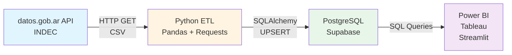

# 📊 IPC Argentina - Automated Data Pipeline

> **ETL pipeline automatizado para análisis de inflación argentina con modelo dimensional en PostgreSQL**

Pipeline end-to-end que extrae datos del Índice de Precios al Consumidor (IPC) desde la API pública de datos.gob.ar, los transforma a un modelo Star Schema y los carga en PostgreSQL con actualizaciones incrementales mensuales.

## 🎯 Objetivo

Centralizar datos históricos de inflación argentina en una base de datos relacional optimizada para análisis multidimensional, permitiendo calcular métricas clave (MoM, YoY, incidencias) y generar insights sobre tendencias económicas por región y categoría.

---

## 🏗️ Arquitectura del Sistema



**Flujo de datos:**
1. **Extracción:** Descarga automática desde API pública (3 endpoints CSV)
2. **Transformación:** Normalización Wide→Long + Parsing de metadata
3. **Carga:** Modelo Star Schema con updates incrementales
4. **Visualización:** Dashboards conectados vía SQL queries

---

## ⚙️ Highlights del Pipeline ETL

### **Extracción**
- Consumo de API REST pública (datos.gob.ar) con manejo de errores y timeouts
- Validación de estructura de datos antes de procesamiento
- Detección automática de nuevos períodos disponibles

### **Transformación**
- **Unpivot:** Conversión de formato Wide a Long usando `pandas.melt()`
- **Parsing:** Extracción de metadata (región, categoría) desde nombres de columnas
- **Limpieza:** Eliminación de nulls, normalización de fechas, validación de tipos

### **Carga**
- **Lógica incremental:** `ON CONFLICT ... DO UPDATE` para prevenir duplicados
- **Modelo dimensional:** Star Schema con tablas fact/dimension optimizadas
- **Índices:** Optimización de queries temporales (`idx_fact_fecha`, `idx_fact_region`)

### **Orquestación**
- Scripts programados (Cron / GitHub Actions) para ejecución mensual automática
- Logs detallados con métricas de inserción/actualización
- Manejo de revisiones retroactivas del INDEC (descarga últimos 2 meses)

---

## 📐 Modelo de Datos - Star Schema

```sql
-- Tablas de Dimensión
CREATE TABLE dim_region (
    region_id SERIAL PRIMARY KEY,
    region_nombre VARCHAR(50) UNIQUE
);

CREATE TABLE dim_categoria (
    categoria_id SERIAL PRIMARY KEY,
    categoria_nombre VARCHAR(100) UNIQUE,
    clasificacion VARCHAR(50)
);

-- Tabla de Hechos
CREATE TABLE fact_inflacion (
    fecha DATE,
    region_id INT REFERENCES dim_region(region_id),
    categoria_id INT REFERENCES dim_categoria(categoria_id),
    valor_indice DECIMAL(18, 4),
    PRIMARY KEY (fecha, region_id, categoria_id)
);

-- Índices
CREATE INDEX idx_fact_fecha ON fact_inflacion(fecha);
CREATE INDEX idx_fact_region ON fact_inflacion(region_id);
CREATE INDEX idx_fact_categoria ON fact_inflacion(categoria_id);
```

**Granularidad:** Mensual | **Período:** Dic 2023 → Presente | **Registros:** ~30,000+

---

## 🚀 Cómo Correr el Proyecto

### **Prerequisitos**
- Python 3.8+
- PostgreSQL (Supabase recomendado)
- Git

### **1. Clonar repositorio**
```bash
git clone https://github.com/tu-usuario/ipc-argentina-pipeline.git
cd ipc-argentina-pipeline
```

### **2. Crear entorno virtual**
```bash
python -m venv venv

# Windows
venv\Scripts\activate

# Linux/Mac
source venv/bin/activate
```

### **3. Instalar dependencias**
```bash
pip install -r requirements.txt
```

### **4. Configurar variables de entorno**

Crear archivo `.env` basado en `.env.example`:

```bash
cp .env.example .env
```

Editar `.env` con tus credenciales:
```env
DB_USER=postgres.tu_project_id
DB_PASSWORD=tu_contraseña_segura
DB_HOST=aws-0-us-west-2.pooler.supabase.com
DB_PORT=6543
DB_NAME=postgres
START_DATE=2023-12-01
```

### **5. Ejecutar carga inicial**

```bash
# Paso 1: Descargar datos
python ipc_scraper.py

# Paso 2: Crear estructura de BD y cargar datos
python db_setup_secure.py
```

Salida esperada:
```
✅ Estructura de base de datos verificada/creada
✅ Proceso completado! Datos sincronizados
   Total registros: 28,450
   Período: 2023-12-01 a 2025-02-01
```

### **6. Actualización mensual**

```bash
python update_monthly.py
```

Salida esperada:
```
📅 Última fecha en DB: 2025-01-01
📥 Descargando datos desde: 2024-11-01
📊 Datos nuevos encontrados: 1,250 registros
✅ ACTUALIZACIÓN COMPLETADA
   Registros insertados: 1,200
   Registros actualizados: 50
```

---

## 📊 Consultas SQL - Window Functions

### **Variación Mensual (MoM) - Month over Month**

```sql
WITH inflacion_mensual AS (
    SELECT 
        f.fecha,
        f.valor_indice,
        LAG(f.valor_indice) OVER (ORDER BY f.fecha) as valor_mes_anterior
    FROM fact_inflacion f
    JOIN dim_region r ON f.region_id = r.region_id
    JOIN dim_categoria c ON f.categoria_id = c.categoria_id
    WHERE r.region_nombre = 'Nacional'
      AND c.categoria_nombre = 'Nivel General'
      AND c.clasificacion = 'Total'
)
SELECT 
    fecha,
    valor_indice as indice_actual,
    ROUND(((valor_indice / valor_mes_anterior - 1) * 100), 2) as variacion_mom_pct
FROM inflacion_mensual
WHERE valor_mes_anterior IS NOT NULL
ORDER BY fecha DESC
LIMIT 12;
```

### **Variación Interanual (YoY) - Year over Year**

```sql
WITH inflacion_yoy AS (
    SELECT 
        f.fecha,
        f.valor_indice,
        LAG(f.valor_indice, 12) OVER (ORDER BY f.fecha) as valor_anio_anterior
    FROM fact_inflacion f
    JOIN dim_region r ON f.region_id = r.region_id
    JOIN dim_categoria c ON f.categoria_id = c.categoria_id
    WHERE r.region_nombre = 'Nacional'
      AND c.categoria_nombre = 'Nivel General'
)
SELECT 
    fecha,
    valor_indice,
    ROUND(((valor_indice / valor_anio_anterior - 1) * 100), 2) as variacion_yoy_pct
FROM inflacion_yoy
WHERE valor_anio_anterior IS NOT NULL
ORDER BY fecha DESC
LIMIT 12;
```

---

## 📊 Business Intelligence & Analytics

El modelo Star Schema está optimizado para conectarse con herramientas de visualización:

### **KPIs Disponibles**

- **Variación MoM (Month over Month):** Inflación del último mes
- **Variación YoY (Year over Year):** Comparación interanual
- **Inflación Acumulada:** Desde inicio del año o período específico
- **Incidencia por Rubro:** Qué categorías explican más la inflación total
- **Análisis Core vs No-Core:** Núcleo, Regulados y Estacionales
- **Disparidad Regional:** Comparación entre GBA, Pampeana, NOA, NEA, Cuyo, Patagonia

### **Herramientas de Visualización**

| Herramienta | Conexión | Casos de Uso |
|-------------|----------|--------------|
| **Power BI** | PostgreSQL Connector | Dashboards ejecutivos, reportes automáticos |
| **Tableau** | Native PostgreSQL | Análisis ad-hoc, storytelling visual |
| **Streamlit** | SQLAlchemy | Aplicaciones web interactivas |
| **Python (Pandas)** | psycopg2 / SQLAlchemy | Análisis exploratorio, notebooks |

### **Ejemplo de Dashboard**

```
┌─────────────────┐  ┌─────────────────┐  ┌─────────────────┐
│ Inflación MoM   │  │ Inflación YoY   │  │ Acumulado 2025  │
│     2.7%        │  │    117.5%       │  │     2.7%        │
│   ▲ +0.3 pp     │  │   ▼ -7.7 pp     │  │   ▲ +2.7 pp     │
└─────────────────┘  └─────────────────┘  └─────────────────┘

Top 5 Categorías por Incidencia:
Alimentos y bebidas      ████████████████████ 1.2pp
Transporte              ████████ 0.5pp
Vivienda                ███████ 0.4pp
Salud                   █████ 0.3pp
Recreación              ████ 0.2pp
```

---

## 🚀 Instalación y Configuración

```bash
# 1. Clonar repositorio
git clone https://github.com/tu-usuario/ipc-argentina-pipeline.git
cd ipc-argentina-pipeline

# 2. Crear entorno virtual e instalar dependencias
python -m venv venv
source venv/bin/activate  # Windows: venv\Scripts\activate
pip install -r requirements.txt

# 3. Configurar credenciales (crear archivo .env)
cp .env.example .env
# Editar .env con tus credenciales de Supabase

# 4. Carga inicial
python ipc_scraper.py              # Descarga datos
python db_setup_secure.py          # Crea estructura y carga

# 5. Actualización mensual (automatizar con cron/GitHub Actions)
python update_monthly.py
```

---

## 🛠️ Stack Tecnológico

| Componente | Tecnología |
|------------|------------|
| **Lenguaje** | Python 3.10+ |
| **ETL** | Pandas, Requests |
| **Base de Datos** | PostgreSQL (Supabase) |
| **ORM** | SQLAlchemy |
| **Orquestación** | GitHub Actions / Cron |
| **BI Tools** | Power BI, Tableau, Streamlit |

---

## 📚 Referencias

- [INDEC - Metodología IPC](https://www.indec.gob.ar/indec/web/Nivel4-Tema-3-5-31)
- [datos.gob.ar - Dataset IPC](https://datos.gob.ar/dataset/sspm-indice-precios-consumidor-nacional-ipc-nivel-general-categorias)
- [Supabase Documentation](https://supabase.com/docs)
